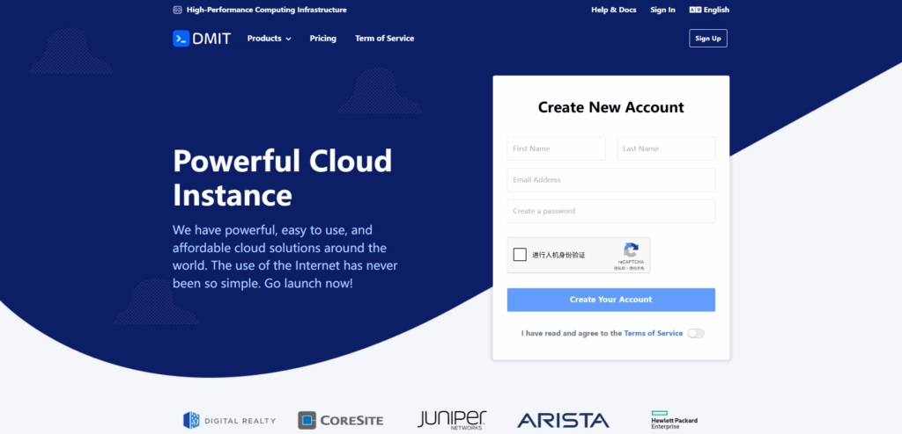

# DMIT VPS：专为中国用户优化的海外服务器方案

如果你正在寻找一款线路稳定、访问速度快、配置灵活的海外VPS，那么DMIT可能是你不错的选择。这家成立于2017年的服务商，虽然在圈内被戏称为"大妈"或"哒咩挨踢",但凭借其优质的网络线路和可靠的服务质量,已经成为不少用户的首选——甚至连知名的搬瓦工都是他们的下游客户。

---

## 为什么选择DMIT?

说实话,市面上的VPS服务商多如牛毛,但DMIT能脱颖而出,靠的不是花哨的营销,而是实打实的硬实力。

**硬件配置够硬核**  
全系采用AMD处理器搭配NVMe SSD存储。什么概念?就是你网站加载速度快、数据读写不卡顿。对于需要高性能计算或者大流量网站来说,这配置完全够用。

**线路优化到位**  
核心节点覆盖洛杉矶、香港、东京三地,接入CN2 GIA、CMIN2、9929等优化线路。翻译成人话就是:国内访问延迟低、速度快、不绕路。你懂的,对于某些特定用途来说,线路质量比价格重要多了。

**稳定性有保障**  
提供99% SLA可用性保证。而且他们还有个很人性化的政策:购买3天内且流量用不到30G可以全额退款;30天内可以按剩余价值退款。每15天还能免费换一次IP。这种服务态度,在行业里算是相当良心了。

---

## 三大产品线,各有千秋

DMIT的产品分类很清晰,每个地区都有三条线:Premium(顶级)、Eyeball(优化)、Tire(国际)。

### Premium系列——追求极致体验

这是DMIT的王牌产品。以日本节点为例,三网CN2 GIA回程,线路有保障。什么叫有保障?就是即使在网络高峰期,你的连接质量也能维持在较高水平。适合对稳定性要求极高的场景,比如需要长时间稳定运行的服务。

### Eyeball系列——性价比之选

采用电信联通9929或移动CMIN2线路,线路"尽力保障"。别小看这个"尽力",在大多数情况下表现都不错。👉 [如果你预算有限但又想要不错的线路质量](https://www.dmit.io/aff.php?aff=13832),Eyeball系列值得考虑。香港和东京节点都有CMI直连回程,对于移动用户来说体验尤其好。

### Tire系列——基础款选择

仅优化区域内部路由,不针对中国优化。适合面向国际用户的业务,或者预算紧张的测试环境。有个小细节挺贴心:流量用完后不会直接断网,而是限速继续运行(根据套餐不同,限速从50Mbps到1Gbps不等)。

---

## 洛杉矶特供:Premium Secure系列

这是洛杉矶独有的产品线,在顶级优化线路基础上,额外配备5T DDoS防护。三网CF去程+CN2 GIA回程的组合,加上高级防护,对于需要建站又担心攻击的用户来说,简直是量身定制。

想想看,网站被DDoS攻击瘫痪的损失有多大?与其事后补救,不如一开始就选个有防护的方案。虽然价格会贵一些,但换来的是安心。

---

## 各地节点怎么选?

**洛杉矶节点**  
如果你的用户主要在国内,洛杉矶是个不错的中转点。Premium系列的CN2 GIA线路,三网直连,延迟控制得很好。Eyeball系列的9929+CMIN2组合,电信联通移动都能照顾到。

**香港节点**  
物理距离近就是优势。Premium系列虽然价格高,但那个延迟真的低到让人舒服。Eyeball系列的CMI直连回程,移动用户会很满意。唯一要注意的是香港带宽相对贵,流量给的不如洛杉矶大方。

**东京节点**  
适合需要覆盖亚太地区的业务。CN2 GIA和CMI两种线路都有,可以根据预算选择。而且日本的网络环境整体不错,即便是Tire系列,只要不是特别依赖中国优化,体验也还行。

---

## 一些使用建议

选VPS就像买鞋,合脚最重要。DMIT的产品线虽然丰富,但也要根据实际需求来选:

- 如果是建站用,尤其是面向国内用户的网站,优先考虑Premium Secure系列或Premium系列
- 如果是个人使用或小型项目,Eyeball系列的性价比更高
- 如果主要服务海外用户,Tire系列足够用,还能省不少钱

另外,DMIT支持按需扩展配置,业务增长了可以随时升级。这点对于创业团队或者个人开发者来说很友好——不用一开始就买高配置,按需付费更经济。

---

## 结语

说了这么多,其实核心就一句话:DMIT是一家踏实做产品的服务商。没有花里胡哨的营销套路,靠的是实实在在的线路质量和服务保障。

无论你是需要稳定建站环境,还是寻找可靠的海外节点,又或者只是想找个性价比高的VPS测试项目,👉 [DMIT的产品线都能满足你的需求](https://www.dmit.io/aff.php?aff=13832)。特别是那个灵活的退款政策和免费换IP服务,让你可以放心试用,不合适就退,没有后顾之忧。

对了,他们家有时候会有促销活动,如果不急着用,可以关注一下。不过即便原价,考虑到线路质量和服务水平,这个价格也算合理。
